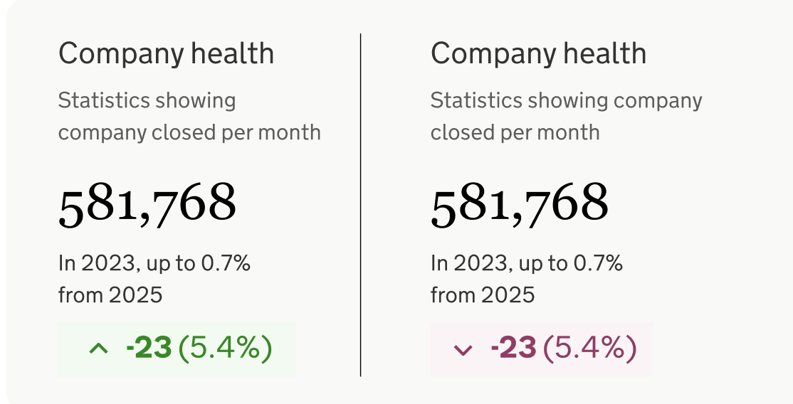
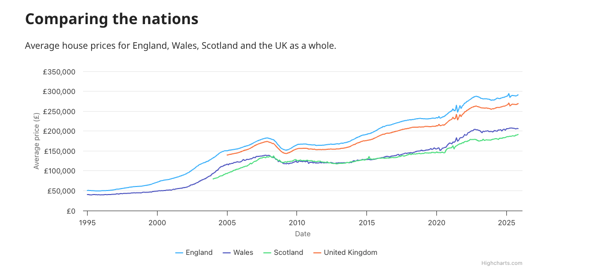
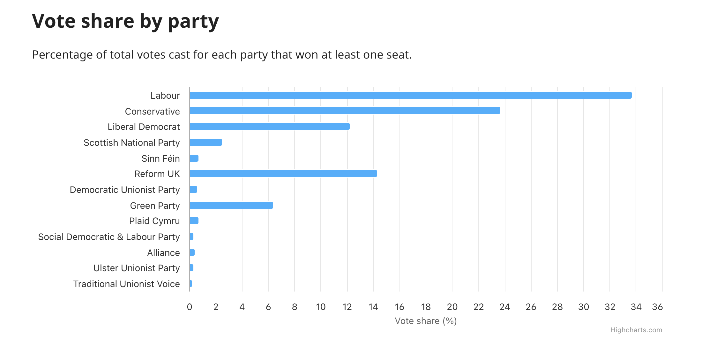
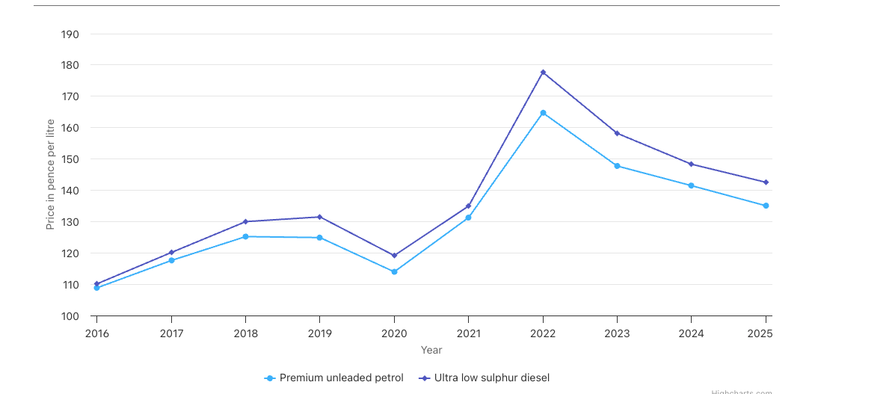
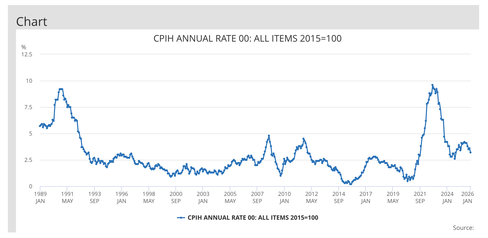
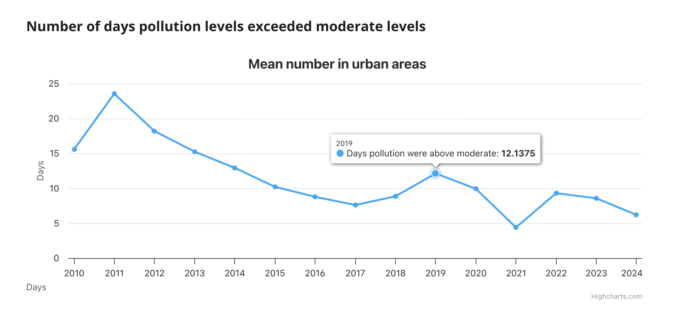

# Visualisation source data

> [!NOTE]
> :white_check_mark: means it's ready to be worked on - i.e. take it away and work it into the page at your leisure
> 
>  :x: means not ready yet
>

***


## Get company information :white_check_mark:

Data is downloadable from this page:

[https://www.gov.uk/government/statistics/companies-register-activities-statistical-release-april-2024-to-march-2025](https://www.gov.uk/government/statistics/companies-register-activities-statistical-release-april-2024-to-march-2025)

Downloaded file:

[https://assets.publishing.service.gov.uk/media/687f74b128f29c99778a744a/Companies_register_activities_April_2024_to_March_2025.xlsx](https://assets.publishing.service.gov.uk/media/687f74b128f29c99778a744a/Companies_register_activities_April_2024_to_March_2025.xlsx)

Table A8 can be extracted to create this CSV:

[Companies_register_activities_April_2024_to_March_2025_table_A8.csv](Companies_register_activities_April_2024_to_March_2025_table_A8.csv) 

The extract is last two financial years, so go back to original if more or different data needed.

The data could be used to create something like this (of course adapted to the topic). For example we could show number of companies formed/disolved over a financial year.




**Updates**

We can monitor for the new page using the GovUK Search API, and download new file on update

GovUK Search API:

[https://www.gov.uk/api/search.json?q=%22Companies%20register%20activities:%20statistical%20release%22&filter_format=official_statistics&order=-public_timestamp](https://www.gov.uk/api/search.json?q=%22Companies%20register%20activities:%20statistical%20release%22&filter_format=official_statistics&order=-public_timestamp
)

Query params
```
q = "Companies register activities statistical release"
format = official_statistics
order = -public_timestamp
```

***

## UK House prices :white_check_mark:

Data was downloaded from here:

[https://www.gov.uk/government/statistical-data-sets/uk-house-price-index-data-downloads-november-2025](https://www.gov.uk/government/statistical-data-sets/uk-house-price-index-data-downloads-november-2025)

This CSV file is linked on that page:

[Average-prices-2025-11.csv](Average-prices-2025-11.csv)


This can be used to create average UK house prices for UK regions or nations from 1968 to 2025. Or could be used to create graph of current average house prices.




**Updates**

We can monitor for the new page using the GovUK Search API, and download new file on update

GovUK Search API:

[https://www.gov.uk/api/search.json?q=%22UK%20House%20Price%20Index:%20data%20downloads%22&filter_format=statistical_data_set&order=-public_timestamp](https://www.gov.uk/api/search.json?q=%22UK%20House%20Price%20Index:%20data%20downloads%22&filter_format=statistical_data_set&order=-public_timestamp)

Query params
```
q = "UK House Price Index: data downloads"
filter_format =  tatistical_data_set
order = -public_timestamp
```

***


## UK General election results :white_check_mark:

Data downloads linked here:

[https://electionresults.parliament.uk/general-elections/6](https://electionresults.parliament.uk/general-elections/6)

Downloaded CSV file:

[parties-general-election-04-07-2024.csv](parties-general-election-04-07-2024.csv)


Data can be sliced and diced in several ways, for example by showing % of vote for party, number of seats etc.



**Updates**

Wait for an election

***

## Fuel and oil prices :white_check_mark:

The main webpage for data download is here:

[https://www.gov.uk/government/statistical-data-sets/oil-and-petroleum-products-monthly-statistics](https://www.gov.uk/government/statistical-data-sets/oil-and-petroleum-products-monthly-statistics)

Excel downloaded from that page:

[https://assets.publishing.service.gov.uk/media/6978dcbad6ab92f1d3a4d6d5/table_411_413__5_.xlsx](https://assets.publishing.service.gov.uk/media/6978dcbad6ab92f1d3a4d6d5/table_411_413__5_.xlsx)

Table 4.1.2 is IMHO the simplest to work with. I exported the table 4.1.2 as csv. There several messy "metadata" pre-header rows to clear out.

CSV extract of Table 4.1.2 here:

[4.1.2-Table_1.csv](4.1.2-Table_1.csv)

Could plot a graph of petrol and diesel prices. Other petrol types available as are various oil types in source data. 




**Updates**

[https://www.gov.uk/api/search.json?q=%22Monthly%20and%20annual%20prices%20of%20road%20fuels%20and%20petroleum%20products%22&filter_format=statistical_data_set](https://www.gov.uk/api/search.json?q=%22Monthly%20and%20annual%20prices%20of%20road%20fuels%20and%20petroleum%20products%22&filter_format=statistical_data_set)

This seems to be a stable page so it looks like we won't get a list of documents. Rather it could be that we'd have to monitor the `public_timestamp` in the response JSON as that will update when the spreadsheet is updated.

***

## Get charity information :x:

JSON file here:

[sector-overview-response.json](sector-overview-response.json)

That file is the response from:

`curl -H "ocp-apim-subscription-key: [your api key here]"  https://api.charitycommission.gov.uk/register/api/sectoroverview`

Sign up for API key here: [https://api-portal.charitycommission.gov.uk/](https://api-portal.charitycommission.gov.uk/)

API document here [reference/API_data_definition_v1.2.pdf](reference/API_data_definition_v1.2.pdf)

The data fields in response JSON are defined in section on SectorDataOverview.

***


## Inflation :white_check_mark:

Main page:

[https://www.ons.gov.uk/economy/inflationandpriceindices](https://www.ons.gov.uk/economy/inflationandpriceindices) 

There are links on this page: to a couple of different inflation measures. CPI (consumer price index) and CPIH (consumer price index + housing) both as an index or rate.

CPIH is the main ONS measure and we'll go with that for now.

I'm guessing most people will have a more intuitive understanding as a rate rather than an index, so have downloaded the current CPIH.

Download link:

[https://www.ons.gov.uk/economy/inflationandpriceindices/timeseries/l55o/mm23]([https://www.ons.gov.uk/economy/inflationandpriceindices/timeseries/d7g7/mm23](https://www.ons.gov.uk/economy/inflationandpriceindices/timeseries/l55o/mm23))

CSV: [series-230226.csv](series-230226.csv) 

Lines 0 to 8 have been used by ONS to add metadata about the series. The information is of interest and this is something folks do, however it's irritating tbh.

Anyway I've left them in as we can snag this for our JSON representation if needed.

Another issue to be aware of is the series is a little "special". It's not one series, but three.

    - lines 9 to 45 inclusive is 1989 - 2025 annualised rate
    - lines 46 to 193 inclusive is 1989 - 2025 by rate by quarter
    - lines 194 to eof is 1989 - 2025 by rate by month

If I'm not mistaken there should be a way of filtering the time series, as in I applied filters in UI then clicked download filtered series, but it didn't work for me. So take your pick from that full time series csv for now :)



**Updates**

Fortunately ONS have provided a nice API to identify the latest publication:

[https://api.beta.ons.gov.uk/v1/datasets/cpih01](https://api.beta.ons.gov.uk/v1/datasets/cpih01)

And it's one hop from there to a csv download.


***

## Air quality :x:

A useful overview page with charts and links to chart data as CSV here:

[https://www.gov.uk/government/statistics/air-quality-statistics/days-with-moderate-or-higher-air-pollution-includes-sulphur-dioxide](https://www.gov.uk/government/statistics/air-quality-statistics/days-with-moderate-or-higher-air-pollution-includes-sulphur-dioxide)

Got this CSV download from the page above

[https://www.gov.uk/csv-preview/685bb9e341d77db4f68eb18e/fig17_urban_days_above_moderate.csv](https://www.gov.uk/csv-preview/685bb9e341d77db4f68eb18e/fig17_urban_days_above_moderate.csv)

Page with links to spreadsheets used in making the public page above:

[https://www.gov.uk/government/statistical-data-sets/env02-air-quality-statistics](https://www.gov.uk/government/statistical-data-sets/env02-air-quality-statistics)

From there you can download this:

[https://assets.publishing.service.gov.uk/media/685bbb2689ba18761d97609f/Air_Pollution_Episodes_2024.ods](https://assets.publishing.service.gov.uk/media/685bbb2689ba18761d97609f/Air_Pollution_Episodes_2024.ods)

This graph shows the number of days a year that pollution levels exceeded moderate in urban areas between 2010 and 2024.



**Updates**

GovUK Search API:

It seems GovUK Search API might help with part as we can check for updates, using `public_timestamp` of main statistics page. From there we could fetch and check CSV.

[https://www.gov.uk/api/search.json?q=%22Days%20with%20%27Moderate%27%20or%20higher%20air%20pollution%22&filter_format=national_statistics](https://www.gov.uk/api/search.json?q=%22Days%20with%20%27Moderate%27%20or%20higher%20air%20pollution%22&filter_format=national_statistics)

Query params
```
q = "Days with 'Moderate' or higher air pollution"
format = national_statistics
```

Or we could get the page with links to the Spreadsheets used

[https://www.gov.uk/api/search.json?q=%22ENV02%20-%20Air%20quality%20statistics%22&filter_format=statistical_data_set](https://www.gov.uk/api/search.json?q=%22ENV02%20-%20Air%20quality%20statistics%22&filter_format=statistical_data_set)

From there again, check public timestamp then look for the correct spreadsheet. I wish the search results included links. Maybe there's another API call we could make?

Query params
```
q = "ENV02 - Air quality statistics"
format = statistical_data_set
```


