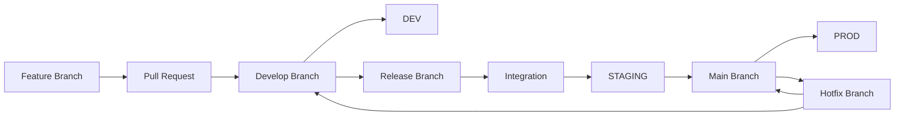
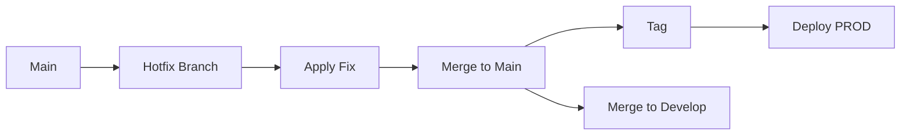
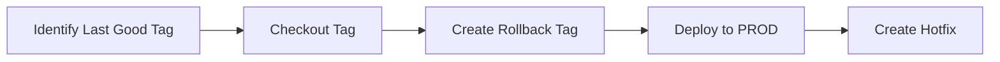

# DATA GOV UK
## Branching and Release Strategy

---

## 1. Introduction

### Purpose
Defines the branching and release strategy for DATA GOV UK software delivery.

### Goals
- Code quality across environments  
- Full traceability  
- Stable releases  
- Predictable promotion path: DEV → Integration → STAGING → PROD  

---

## 2. Key Principles

- One release branch per version  
- All fixes go into release branch  
- Each fix generates a new tag  
- Always deploy latest tag  
- No direct commits to protected branches  

---

## 3. Branching Model

| Branch | Purpose | Deployment |
|------|--------|-----------|
| main | Production code | PROD |
| develop | Active development | DEV |
| release/X.Y.Z | Release testing | Integration, STAGING |
| feature/* | Feature work | DEV |
| hotfix/* | Critical fixes | PROD |

---

## 4. End-to-End Workflow

---

## 5. Development Workflow

1. Create feature branch from develop  
2. Make changes and commit  
3. Push branch  
4. Create PR to develop  
5. Review and merge  
6. Auto deploy to DEV  

---

## 6. Release Process

1. Create release branch from develop tag
2. Deploy to Integration
3. Apply fixes via release branches
4. Promote to STAGING with approval
5. Merge to main
6. Create production tag
7. Deploy to PROD

---

## 7. Environment Mapping

| Environment | Branch | Deployment |
|------------|--------|-----------|
| DEV | develop | Automatic |
| Integration | release | Automatic |
| STAGING | release | Manual approval |
| PROD | main | Tag based |

---

## 8. Deployment Rules

### DEV
- Used for development only  
- No release branch deployments  

### Integration
- First validation stage  
- Always latest patch  

### STAGING
- Controlled promotion
- Requires approval
- Final validation before production
- All environments aligned

### PROD
- Only tagged releases  
- No direct commits  

---

## 9. Hotfix Workflow

---

## 10. Emergency Rollback

---

## 11. Branch Protection Rules

### Main
- Minimum 2 approvals  
- CI checks must pass  
- No bypass  
- Restricted push access  

### Develop
- Minimum 1 approval  
- CI checks must pass  
- Auto delete branches  

### Release
- Restricted to release team  

---

## 12. Tagging Strategy

### Semantic Versioning

vMAJOR.MINOR.PATCH

- MAJOR: Breaking changes  
- MINOR: New features  
- PATCH: Bug fixes  

---

## 13. Merge Strategy

- Feature → develop: squash merge  
- Release → main: merge commit  
- Hotfix → main and develop: merge commit  

---

## 14. Code Review Standards

- Review within 24 hours  
- Validate code quality  
- Ensure tests exist  
- CI must pass  
- No merge conflicts  

---

## 15. Pull Request Guidelines

- Clear title and description  
- Include ticket reference  
- Describe changes and testing  

---

## 16. Best Practices

- Keep branches short lived  
- Avoid long running features  
- Always deploy from tags  
- Keep environments aligned  
- Automate deployments  
