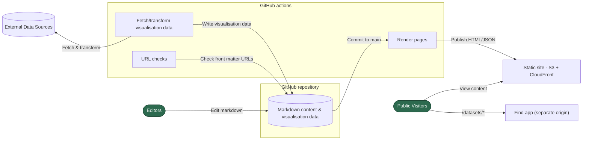
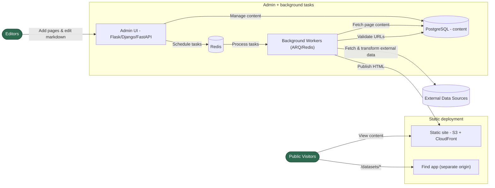
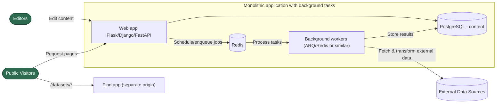

# High level Solution Architecture diagrams

Functional architecture for options described here [high-level-solution-architecture.md](high-level-solution-architecture.md).

## Option 1 – GitHub managed static site

## Option 2 – Admin UI + static pages

## Option 3 – Admin UI + Server side rendering

