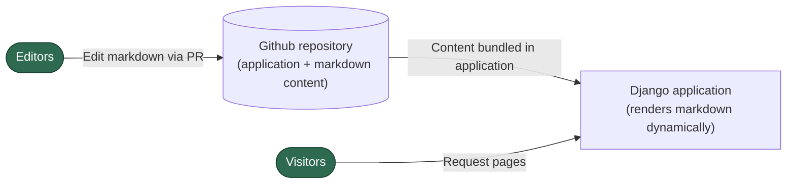
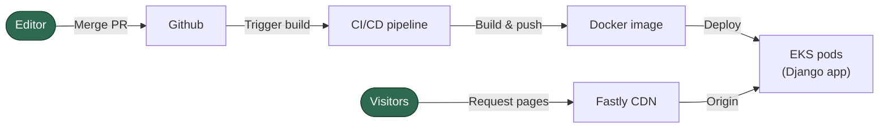
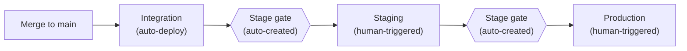

# High Level Solution Architecture

## Architecture overview

The solution is a full-stack Django web application with a deliberately minimal footprint:

- **No database** - there will be no persistence layer needed at this stage.
- **No admin interface** - content will not be managed through the application.
- **Markdown as content** - pages are to be authored as markdown files that live in the application repository. The Django application then renders them dynamically on each request.
- **Content editing happens in Github** - editors work with markdown files directly in the Github, using pull requests for review.

## Deployment

The application will be in a new repository (separate from this current find application repo). It will be containerised and deployed into the existing EKS cluster.

- **Docker image** built in CI/CD on merge to `main`.
- **EKS pods** runs the Django application in the existing cluster.
- **Fastly CDN** sits in front of the application

## Deployment pipeline

Because markdown content will be bundled inside the application image, every content change requires an application deployment. The pipeline therefore needs to be as quick and frictionless as possible.

**Promotion flow:**

1. **Merge to `main`** - already automatically deploys to the **integration** environment. No manual intervention required.
2. **Integration to staging** - the integration deployment should be updated to up a stage gate for staging promotion. Someone then can accept & trigger the promotion. The gate should be created without manual via copying tags/shas.
3. **Staging to production** - same pattern: the staging deployment sets up the production gate for someone to accept & triggers the promotion.

A key concern and requirement is that the pipeline from merge to production must be streamlined enough that content updates aren't held up by a complex manual promotion processes.

Note in the longer term we should aim towards a continuous delivery model enabled by automated testing, especially as the site is a relatively simple content site.

## What this approach enables

Running a Django application rather than a static site exchanges some of the operational/infrastructure benefits for more direct incremental evolution options.

### Migration path to a database and admin interface

The solution starts with no database, but Django makes it straightforward to add one if needed. 

If the volume of content grows such that content editing via github becomes toO onerous, frontmatter metadata and page content can be migrated into PostgreSQL and a lightweight admin interface built, without changing the hosting or deployment model. Even if the complexity of the site reaches the point that a full blown CMS is needed, there are upgrade paths for example to Wagtail which is a Django based CMS.

### Search without additional infrastructure

With a static site, search requires a separate indexing pipeline, a search service (e.g. OpenSearch), and an API layer (Lambda + API Gateway) to query it. 

A Django application can implement search server side, whether that's simple content scanning for a small number of pages or a database backed search index later. If search needs scale beyond what the application can handle directly, content can be pushed to an AWS managed search service from the application itself. This keeps the indexing pipeline simple and avoids the need for separate Lambda functions or API Gateway layers.

### Redirects in application code

Redirects can be handled natively in Django's URL configuration or views. There is no need for CDN level or reverse proxy URL rewriting (Cloudfront Functions, Lambda@Edge, or Fastly VCL) to manage redirect rules. Adding, changing, or removing redirects is a code change.

### Clean URL routing

Static sites on S3 require careful handling of trailing slashes, `index.html` conventions, and possibly Cloudfront Functions to normalise URLs. Django's URL routing handles clean URLs (`/collection/business-and-economy`) natively with no CDN configuration needed.

### Simplified security model

The previously discussed static site approach required Github Actions to have write access to an S3 bucket in AWS, which requires consideration of cross account access and credential management. With content bundled in the Docker image, the deployment pipeline pushes a container image to a registry and deploys to EKS, a standard CI/CD pattern that doesn't require granting external systems direct access to serving infrastructure.
